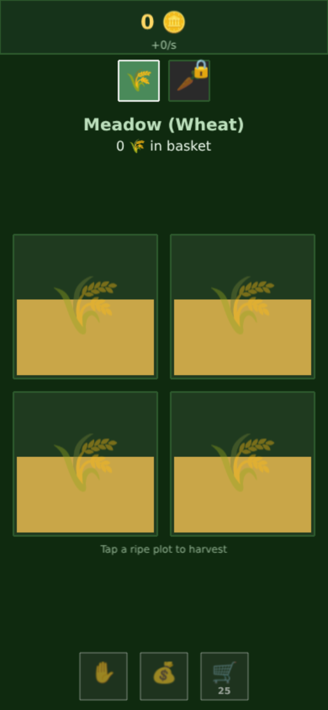
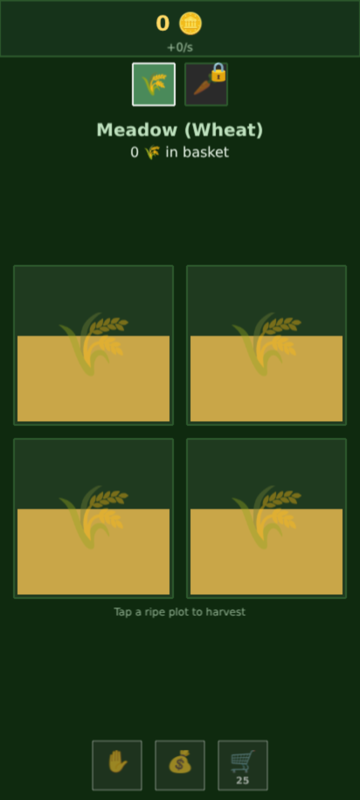
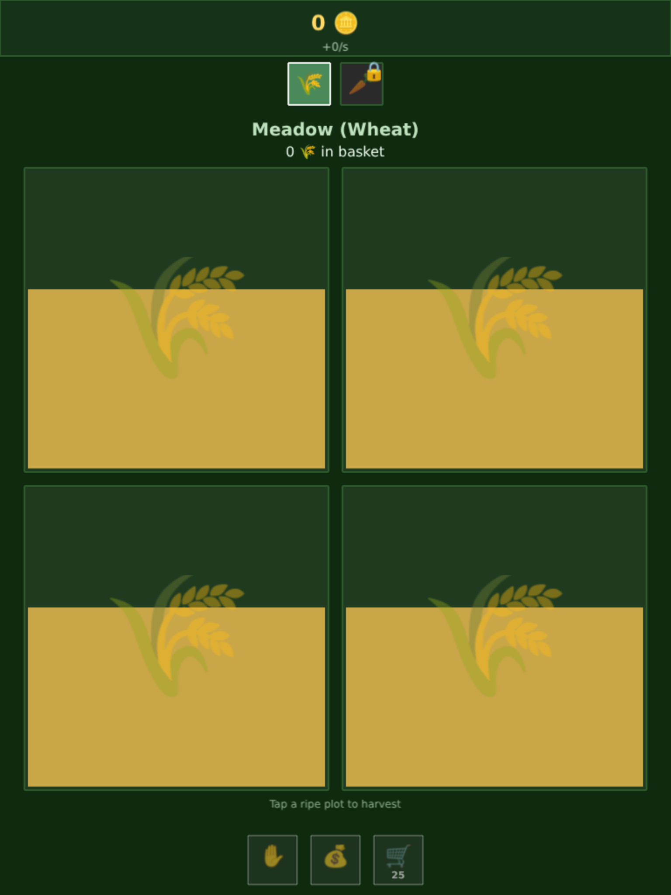
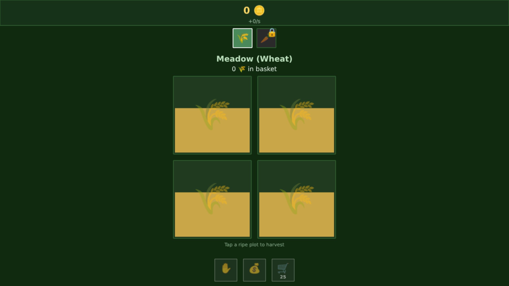
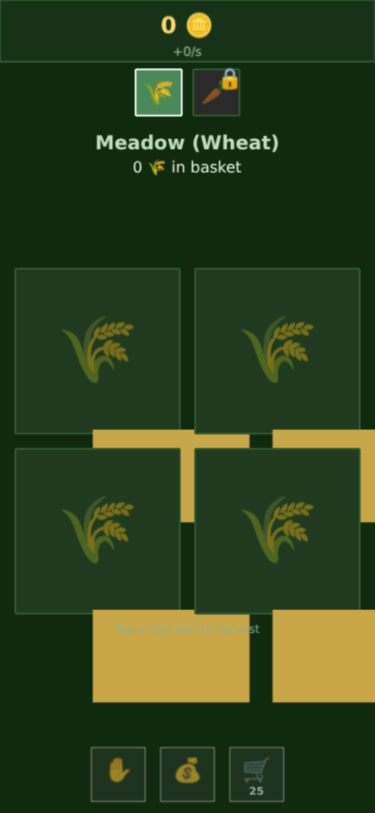
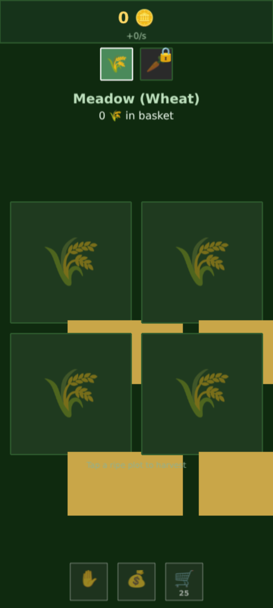
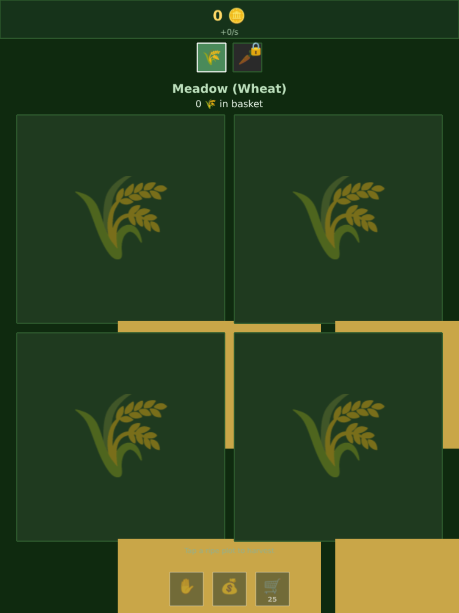
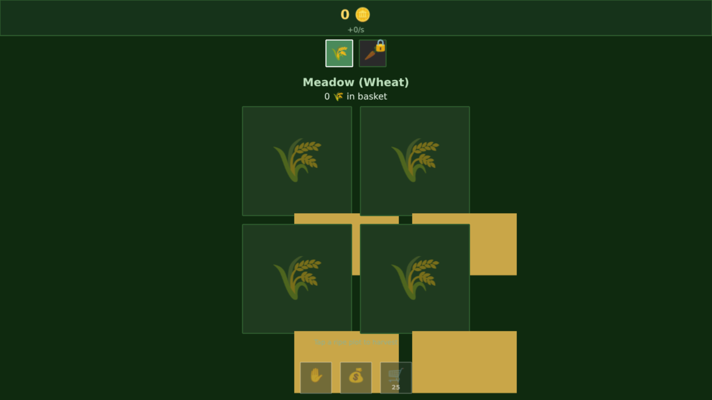

# Screenshot Log

Visual record of UI changes over time. Newest first.

## 20260501-094256 — fill-fix

Fixed plot fill bars to use `setSize` so they correctly grow inside the plot bounds. Cart base interval reduced from 8s to 5s for better AFK pacing.

- **iphone-13** (390×844): 
- **pixel-7** (412×915): 
- **ipad-mini** (768×1024): 
- **desktop** (1280×720): 

## 20260501-093746 — baseline

First screenshot capture. Reveals plot fill bars overflowing the plot bounds (later fixed in fill-fix).

- **iphone-13** (390×844): 
- **pixel-7** (412×915): 
- **ipad-mini** (768×1024): 
- **desktop** (1280×720): 
